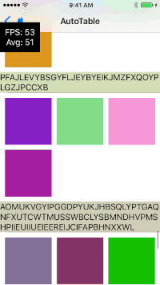

<p align="center" >
  
</p>  

# SMFpsMonitor

A monitor show Fps in the view.window  
SMFpsMonitor is a Monitor to show Fps in the view.window easily  
You can touch SMFpsMonitor, and it will show FPS Trending  

```swift  

class MyViewController: UIViewController {

    override func viewDidLoad() {
        super.viewDidLoad()

        let m = SMFpsMonitor()
        m.run()
        
    }

}
```  
  

## License  
MIT license. See the `LICENSE` file for details.
